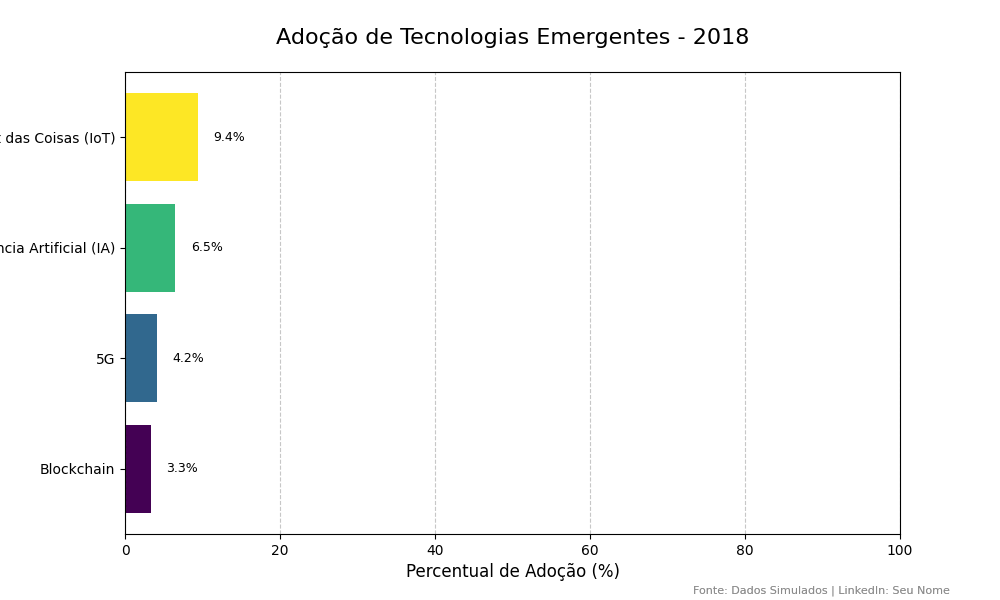

# Projeto: Visualização de Dados Interativa e Data Storytelling

[](https://opensource.org/licenses/MIT)

Este projeto demonstra a criação de **visualizações de dados animadas e interativas (Data Storytelling)**, com foco na evolução da adoção e investimento em tecnologias emergentes. O objetivo é transformar dados brutos em uma narrativa visual dinâmica, utilizando o poder da animação para destacar tendências e padrões ao longo do tempo de forma impactante para a comunidade profissional, especialmente no LinkedIn.

## 🚀 Demonstração

Em breve, o GIF final gerado será adicionado aqui, mostrando a animação da adoção de tecnologias emergentes ao longo dos anos.

<p align="center">
  
</p>

## 🎯 Objetivo

O principal objetivo é visualizar a evolução da **adoção de tecnologias emergentes (Inteligência Artificial, Blockchain, IoT, 5G)** e o investimento associado a elas ao longo dos anos. A animação busca tornar a compreensão dessas tendências mais acessível e engajadora, permitindo uma análise rápida do crescimento e impacto de cada tecnologia.

## 💻 Tecnologias Utilizadas

Este projeto foi desenvolvido utilizando as seguintes bibliotecas Python:

* **Python**: Linguagem principal do projeto.
* **Pandas**: Essencial para manipulação e análise eficiente dos dados simulados.
* **NumPy**: Utilizado para operações numéricas e para a simulação dos dados.
* **Matplotlib**: Utilizado para a criação de visualizações estáticas e, em conjunto com `matplotlib.animation`, para gerar a animação.
* **Pillow**: Biblioteca necessária para o Matplotlib salvar a animação no formato GIF.
* **Jupyter Notebook**: Ambiente de desenvolvimento interativo para execução e visualização do código.

## ⚙️ Como Funciona

1.  **Geração de Dados Sintéticos**: O notebook simula um dataset contendo dados anuais sobre o percentual de adoção e o investimento em diferentes tecnologias emergentes.
2.  **Preparação e Animação**: Os dados são processados para criar uma sequência de visualizações de barras horizontais, onde cada frame representa um ano específico. A altura das barras e os valores são atualizados dinamicamente.
3.  **Contador Temporal**: O ano atual é exibido de forma proeminente no título do gráfico, guiando o espectador através da linha do tempo.
4.  **Exportação para GIF**: A sequência de frames animados é compilada e salva como um arquivo `.gif` de alta qualidade na pasta `media/`.

## 🚀 Como Executar

Para rodar este projeto em seu ambiente local e gerar o GIF, siga os passos abaixo:

1.  **Clone o repositório**:

    ```bash
    git clone [https://github.com/SeuNomeDeUsuario/Visualizacao_de_Dados_Interativa_ou_Data_Storytelling.git](https://github.com/SeuNomeDeUsuario/Visualizacao_de_Dados_Interativa_ou_Data_Storytelling.git)
    cd Visualizacao_de_Dados_Interativa_ou_Data_Storytelling
    ```
    (Lembre-se de substituir `SeuNomeDeUsuario` pelo seu nome de usuário do GitHub quando criar o repositório.)

2.  **Estrutura de Pastas (já configurada pelo projeto):**
    Certifique-se de que a estrutura de pastas do projeto esteja correta:
    ```
    seu_projeto/
    ├── notebooks/
    │   └── 01_data_generation_and_gif.ipynb
    ├── media/
    │   └── adocao_tecnologias_emergentes.gif (será gerado)
    ├── data/
    │   └── simulated_data.csv (já fornecido)
    └── src/
        └── config.py (já fornecido)
    ```

3.  **Instalar as dependências**:
    Recomenda-se criar um ambiente virtual para isolar as dependências do projeto.

    ```bash
    python -m venv .venv
    # No Windows:
    .\.venv\Scripts\activate
    # No macOS/Linux:
    source ./.venv/bin/activate
    pip install -r requirements.txt
    ```

4.  **Rodar o Código**:
    O código principal para a geração da animação e dos dados simulados está no arquivo `notebooks/01_data_generation_and_gif.ipynb`. Abra-o em um ambiente Jupyter Notebook ou Jupyter Lab e execute todas as células.

    ```bash
    jupyter lab
    # ou
    jupyter notebook
    ```
    Navegue até o notebook e execute-o.

5.  **Visualize o Resultado**:
    Após a execução bem-sucedida do notebook, o GIF `adocao_tecnologias_emergentes.gif` será salvo na pasta `media/`, pronto para ser compartilhado.

## 🤝 Contribuições

Contribuições, sugestões e melhorias são sempre bem-vindas! Se você tiver ideias para aprimorar este projeto, sinta-se à vontade para abrir uma *issue* ou enviar um *pull request*.

## 📄 Licença

Este projeto está licenciado sob a Licença MIT - veja o arquivo [LICENSE.md](LICENSE.md) para mais detalhes.

## 📧 Contato

Se você tiver alguma dúvida ou sugestão, entre em contato:

* **Nome**: Flávio Henrique Barbosa
* **LinkedIn**: [Flávio Henrique Barbosa | LinkedIn](https://www.linkedin.com/in/fl%C3%A1vio-henrique-barbosa-38465938)
* **Email**: flaviohenriquehb777@outlook.com

---
**Flávio Henrique Barbosa** | Data: Julho de 2025